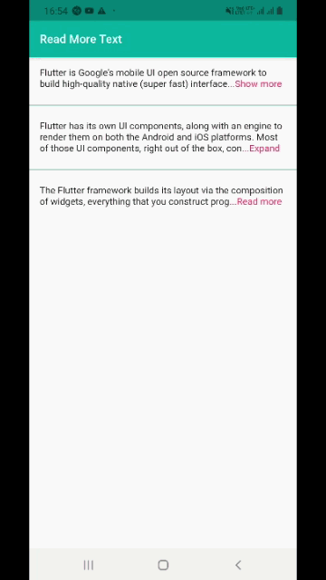

# readmore

A Flutter plugin that allows to expansion and collapse of text.

# Support flutter 3


## usage:
add to your pubspec

```
readmore: 
```
and import:
```
import 'package:readmore/readmore.dart';
```

```dart
ReadMoreText(
  'Flutter is Google’s mobile UI open source framework to build high-quality native (super fast) interfaces for iOS and Android apps with the unified codebase.',
  trimLines: 2,
  colorClickableText: Colors.pink,
  trimMode: TrimMode.line,
  trimCollapsedText: 'Show more',
  trimExpandedText: 'Show less',
  moreStyle: TextStyle(fontSize: 14, fontWeight: FontWeight.bold),
);
```


